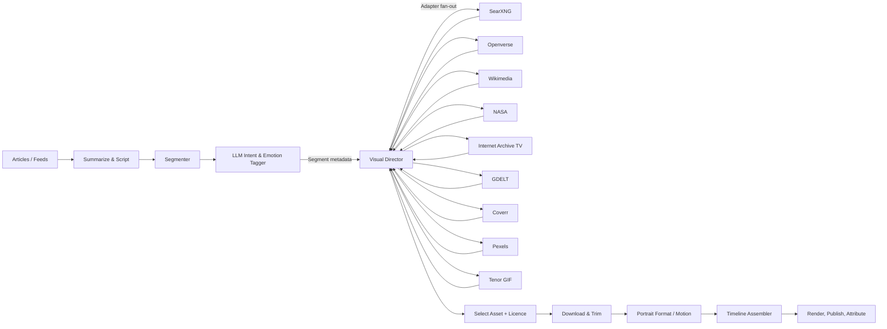

# Visual Director Revamp Plan

> **Goal:** Turn the current image‑only, proper‑noun‑driven visual lookup into a **hands‑free, multi‑source, licence‑aware visual selection engine** that can choose *images, video clips, or reaction GIF cutaways* for each scripted segment in your short‑form (30‑60s) portrait videos.
>
> **Key shift:** Replace brittle NER‑only logic with **LLM‑assisted intent & emotion labeling**, while preserving a light NER fallback. Drive *all* sourcing through a pluggable adapter layer that queries many free/open sources in parallel, scores results locally, and returns one best asset per segment.

---

## Table of Contents

1. [Objectives & Non‑Goals](#objectives--non-goals)
2. [High‑Level Data Flow](#high-level-data-flow)
3. [LLM Intent + Emotion Tagging](#llm-intent--emotion-tagging)
4. [Segment Metadata Schema](#segment-metadata-schema)
5. [Source Adapter Interface](#source-adapter-interface)
6. [Free Source Adapters to Implement](#free-source-adapters-to-implement)
7. [Reaction GIF Integration (Tenor-first)](#reaction-gif-integration-tenor-first)
8. [Relevance Scoring & Selection](#relevance-scoring--selection)
9. [Image‑vs‑Video Decision Logic](#image-vs-video-decision-logic)
10. [Licence Tracking & Attribution](#licence-tracking--attribution)
11. [Caching & Deduplication](#caching--deduplication)
12. [Download + Trim + Portrait Prep](#download--trim--portrait-prep)
13. [Pipeline Integration Steps](#pipeline-integration-steps)
14. [Configuration & Secrets](#configuration--secrets)
15. [Minimal End‑to‑End Example](#minimal-end-to-end-example)
16. [Testing Checklist](#testing-checklist)
17. [Incremental Rollout Plan](#incremental-rollout-plan)
18. [Future Enhancements](#future-enhancements)

---

## Objectives & Non‑Goals

**Objectives**

* Query *multiple free/open* visual sources in parallel.
* Use **LLM** to decide: *needs visual?* If yes → *type* (image / video / reaction / none) and *search terms*.
* Prefer **public‑domain / CC0**; fall through to other free sources; optional paid sources behind flag.
* Score candidates locally (text + visual + licence + fit).
* Auto‑trim video; auto‑reframe to portrait 9:16.
* Track licence + attribution metadata end‑to‑end.
* Drop short reaction GIF/MP4 cutaways for humor (Fireship vibe) when script warrants.

**Non‑Goals (phase 1)**

* No full semantic video understanding (frame‑level content search) beyond thumbnail CLIP embedding.
* No scene‑detection within long downloads (trim by provided timestamps or uniform sample).
* No automated brand‑safety classification beyond Tenor `contentfilter` param.

---

## High‑Level Data Flow



---

## LLM Intent & Emotion Tagging

Instead of pure NER, prompt an LLM (multi‑modal optional, text‑only OK) to label each segment.

**Input to LLM:**

* Segment text.
* Previous/next segment text (context).
* Known entities (optional NER pre‑pass to aid LLM).
* Allowed reaction label set.

**Output JSON (per segment):**

```json
{
  "segment_id": "seg_03",
  "needs_visual": true,
  "visual_type": "image" | "video" | "reaction" | "none",
  "search_terms": ["OpenAI", "Sam Altman"],
  "entities": ["Sam Altman", "OpenAI"],
  "emotion": "mind_blown",  // used if reaction
  "duration_hint_s": 4.2
}
```

### Prompt Sketch

```text
You label short narration lines for an automated social video editor.
For each line: decide if we should show a visual.
- Choose visual_type:
  - image: show who/what is being mentioned (logo, headshot, place).
  - video: show the action/event.
  - reaction: short funny reaction (gif) to emphasize tone.
  - none: keep narrator on screen only.
Return JSON.
Line: "OpenAI just open‑sourced a new robotics model." -> image(OpenAI logo) + reaction(mind_blown)?
Line: "Watch this robot assemble furniture in seconds." -> video(robot assembling furniture).
```

### Hybrid Safety

Run cheap NER (spaCy) first; feed the top entities into the LLM prompt so it rarely misses proper nouns.

---

## Segment Metadata Schema

Augment your current segment object (you already store text + duration) with:

```python
@dataclass
class Segment:
    id: str
    text: str
    start_s: float  # narrative timeline
    end_s: float
    duration_s: float
    entities: list[str] = field(default_factory=list)
    visual_type: str = "auto"  # image|video|reaction|none|auto
    search_terms: list[str] = field(default_factory=list)
    emotion: str | None = None  # for reaction
    licence_floor: str = "free"  # free|pd_only|any|paid_ok
```

Persist to JSON so later stages can re‑run without re‑prompting the LLM.

---

## Source Adapter Interface

Uniform return type lets you fan‑out & score consistently.

```python
from dataclasses import dataclass
from enum import Enum

class MediaType(str, Enum):
    IMAGE = "image"
    VIDEO = "video"
    GIF   = "gif"      # Tenor short loops

@dataclass
class Asset:
    provider: str
    media_type: MediaType
    url: str             # canonical download URL
    preview_url: str | None
    width: int | None
    height: int | None
    duration_s: float | None
    title: str | None
    description: str | None
    licence: str         # e.g., PD, CC0, CC-BY-4.0, Free-Pexels
    attribution: str | None
    cost_usd: float = 0.0
    provider_score: float = 0.0  # provider relevance if available
    start_s: float | None = None # clip start within source, if known
    end_s: float | None = None
```

```python
class Adapter(Protocol):
    name: str
    media_supported: set[MediaType]
    async def search(self, terms: list[str], *, media: MediaType | None = None, limit:int=20) -> list[Asset]: ...
```

Register adapters in a list; sort by *preference* (PD‑first) or just run all and let scoring decide.

---

## Free Source Adapters to Implement

Below are core free/open providers. (Paid sources behind flag; not shown here.)

| Adapter                      | Media                  | Licence Notes                         | Key Params to Map                             |
| ---------------------------- | ---------------------- | ------------------------------------- | --------------------------------------------- |
| **SearXNG**                  | image/video meta‑meta  | depends on upstream; filter domains   | `categories=images,videos` + engine whitelist |
| **Openverse**                | images, audio          | CC licences, includes attribution     | `q`, `license_type`, `page_size`              |
| **Wikimedia Commons**        | images + some video    | Mixed; most freely licensable         | MediaWiki API `action=query&prop=imageinfo`   |
| **NASA**                     | images+video PD        | Public domain                         | `q`, media\_type=video                        |
| **Internet Archive TV News** | 60s MP4 clips          | Fair use research; check usage        | caption search -> download id                 |
| **GDELT TV 2.0**             | frame tags, thumbs     | research; PD metadata                 | docapi -> start time                          |
| **Coverr**                   | stock video CC0        | abstract loops                        | API key `?query=`                             |
| **Pexels**                   | stock video/image free | broad free use; attribution suggested | `search` endpoints                            |
| **Tenor**                    | GIF/short MP4          | free w/ attribution                   | `/search?q=` + `media_filter`                 |

*(Document detailed ToS in code comments & config.)*

---

## Reaction GIF Integration (Tenor-first)

**Why Tenor first:** Free tier, no strict anti‑commingling clause like GIPHY, JSON response includes MP4 variants (easy to edit), aspect‑ratio filtering.

### Reaction Label Map

```python
REACTION_TAG_MAP = {
  "laugh": ["lol", "laugh", "haha"],
  "facepalm": ["facepalm", "smh"],
  "mind_blown": ["mind blown", "explosion", "whoa"],
  "shrug": ["shrug", "idk"],
  "applause": ["applause", "clap"],
  "shock": ["shock", "shocked", "omg"],
}
```

Pick the first synonym that tests highest in Tenor history cache (see caching section).

### Tenor Search Call (async)

```python
async def tenor_search(label:str, limit:int=5) -> list[Asset]:
    q = random.choice(REACTION_TAG_MAP.get(label, [label]))
    params = {
        "q": q,
        "key": TENOR_API_KEY,
        "limit": limit,
        "media_filter": "minimal",  # tinygif,gif,mp4
        "ar_range": "standard",
        "contentfilter": "medium",
        "locale": "en_US",
    }
    data = await http_json(TENOR_ENDPOINT, params)
    return [tenor_to_asset(r) for r in data["results"]]
```

### Slotting Reactions

During segment assembly:

* If `visual_type==reaction`, overlay the chosen GIF as **full‑screen cut** OR **PIP sticker** depending on segment duration.
* Default duration = min(asset.duration\_s, segment\_pause\_window).
* Loop if asset shorter than needed.

---

## Relevance Scoring & Selection

All candidate Assets from all adapters are pooled and scored.

### Signals & Weights (tune!)

| Signal              | Range | Weight | Notes                                                  |             |    |
| ------------------- | ----- | ------ | ------------------------------------------------------ | ----------- | -- |
| **Text match**      | 0‑1   | 0.4    | Fuzzy match query terms in title/desc/filename.        |             |    |
| **Visual semantic** | 0‑1   | 0.25   | CLIP cosine(query\_embed vs. thumb\_embed).            |             |    |
| **Licence**         | 0‑1   | 0.15   | PD=1, CC0=0.9, CC‑BY=0.7, Free Stock=0.6, Unknown=0.2. |             |    |
| **Orientation fit** | 0‑1   | 0.1    | Closer to 9:16 gets more points (                      | ratio‑1.777 | ). |
| **Duration fit**    | 0‑1   | 0.1    | Closer to segment duration.                            |             |    |

```python
def score_asset(asset:Asset, query_embed, seg_dur:float) -> float:
    tmatch = fuzzy_text_score(asset, terms)
    vsim   = clip_score(query_embed, asset.preview_url)
    lic    = licence_weight(asset.licence)
    orient = portrait_score(asset.width, asset.height)
    dur    = duration_score(asset.duration_s, seg_dur)
    return 0.4*tmatch + 0.25*vsim + 0.15*lic + 0.1*orient + 0.1*dur
```

Sort desc; pick top. Optionally keep top‑k for A/B testing.

---

## Image‑vs‑Video Decision Logic

Use LLM output **plus** fallback heuristics:

1. If `visual_type=image` → query image‑only adapters first (SearXNG‑images, Openverse, Wikimedia, NASA image).
2. If `visual_type=video` → video adapters first (Archive, Coverr, Pexels video, NASA video).
3. If `visual_type=reaction` → Tenor.
4. If `visual_type=auto`:

   * If segment contains named entity & verb is *stative* ("is", "was", "announced") → image.
   * If contains action verb ("launched", "demoed", "crashed") → video.

*(Simple POS/dep parse; included because LLMs occasionally mis‑label.)*

---

## Licence Tracking & Attribution

Add licence & attribution fields to the asset metadata and persist.

### Storage

`assets_meta/{sha256}.json`

```json
{
  "provider": "Wikimedia",
  "licence": "CC-BY-SA-4.0",
  "attribution": "Photo by ExampleUser via Wikimedia Commons",
  "source_url": "...",
  "downloaded": "2025-07-16T10:00:00Z"
}
```

### Runtime Rules

* **Public Domain / CC0:** no overlay required (optional credit).
* **CC‑BY / provider‑required:** auto‑render 2‑line caption in lower left for ≥2s cumulative display OR include rolling credit at end card.
* Collect all attributions per video → output `.srt` or `.txt` license bundle next to final MP4.

---

## Caching & Deduplication

**Levels:**

1. **Query cache:** query string → list\[Asset] (JSON) for 24h.
2. **Download cache:** url → local path; keyed by SHA‑256 of bytes.
3. **Entity canonical:** best known asset per entity (logo, headshot) pinned in DB.

Use SQLite or DuckDB; path columns store relative asset paths for portability.

```sql
CREATE TABLE asset_cache (
  url TEXT PRIMARY KEY,
  sha256 TEXT,
  path TEXT,
  licence TEXT,
  width INT, height INT, duration REAL,
  fetched TIMESTAMP DEFAULT CURRENT_TIMESTAMP
);
```

---

## Download + Trim + Portrait Prep

Most free sources return *full* media. Standardize via ffmpeg.

### Download

```python
async def fetch_asset(asset:Asset) -> Path:
    raw = await download_bytes(asset.url)
    sha = sha256(raw)
    out = MEDIA_DIR/sha
    out.write_bytes(raw)
    return out
```

### Trim (if timestamps present & media\_type==VIDEO)

```bash
ffmpeg -ss {start} -to {end} -i input.mp4 -c copy clipped.mp4
```

If re‑encode needed (scale/crop):

```bash
ffmpeg -i clipped.mp4 -vf "scale=-2:1920:force_original_aspect_ratio=increase,crop=1080:1920" -an clipped_v.mp4
```

### Ken Burns for Stills

```bash
ffmpeg -loop 1 -i img.jpg -vf "zoompan=z='min(zoom+0.0015,1.1)':d=125" -t {dur} -pix_fmt yuv420p kb.mp4
```

Or animate in compositor (ffmpeg filter\_complex w/ `scale`, `crop`, `zoompan`).

---

## Pipeline Integration Steps

Below maps *old → new* tasks.

| Old Stage                   | New Stage Changes                                                                                    |
| --------------------------- | ---------------------------------------------------------------------------------------------------- |
| **Article ingest**          | no change                                                                                            |
| **Narrative spinner**       | ensure clean sentences; mark emphatic lines with punctuation (helps LLM emotion)                     |
| **Segmenter**               | output segment timings used by LLM + visual\_director                                                |
| **(NEW) LLM Intent Tagger** | run after segmenter; produce metadata JSON                                                           |
| **visual\_director**        | refactor to adapter fan‑out + scoring; accept segment metadata; return `AssetChoice` (path, licence) |
| **Renderer**                | add image motion, reaction overlay logic, attribution burn‑in                                        |
| **Publish**                 | include license bundle; optionally list sources in caption                                           |

---

## Configuration & Secrets

`config.yaml` example:

```yaml
visual_director:
  allow_paid: false
  max_results_per_source: 20
  portrait_width: 1080
  portrait_height: 1920
  min_score: 0.45
  reaction_min_conf: 0.6
  providers:
    searxng:
      endpoint: http://localhost:8888/search
      engines: [wikimedia, duckduckgo_images]
    openverse:
      api_key: null  # public
    nasa:
      api_key: DEMO_KEY
    tenor:
      api_key: ${TENOR_API_KEY}
    pexels:
      api_key: ${PEXELS_API_KEY}
```

Secrets passed via env; load with `python-dotenv` or your existing secrets loader.

---

## Minimal End‑to‑End Example

```python
async def build_video(script_text:str):
    segments = segment_script(script_text)              # -> list[Segment]
    segments = await llm_label_segments(segments)       # fill entities, visual_type, search_terms, emotion
    vd = VisualDirector(adapters=ALL_ADAPTERS)
    for seg in segments:
        asset = await vd.pick_asset(seg)
        seg.asset_path = await process_asset(asset, seg)  # download, trim, portraitize
    return assemble_timeline(segments)  # ffmpeg concat, overlays, TTS, music
```

### VisualDirector.pick\_asset

```python
class VisualDirector:
    def __init__(self, adapters):
        self.adapters = adapters

    async def pick_asset(self, seg:Segment) -> Asset:
        media_pref = _media_pref(seg.visual_type)
        tasks = [a.search(seg.search_terms, media=media_pref) for a in self.adapters if media_pref in a.media_supported or media_pref is None]
        results_nested = await asyncio.gather(*tasks, return_exceptions=False)
        candidates = [c for sub in results_nested for c in sub]
        if not candidates:
            return generate_ai_fallback(seg)
        scored = [(score_asset(c, embed(seg.text), seg.duration_s), c) for c in candidates]
        scored.sort(reverse=True, key=lambda x:x[0])
        best = scored[0][1]
        return best
```

---

## Testing Checklist

* [ ] LLM JSON is valid & conforms schema.
* [ ] Entity -> canonical asset caching works.
* [ ] Multi‑adapter fan‑out returns within latency budget (<3s typical).
* [ ] Scoring picks expected PD asset when available.
* [ ] Reaction insertion frequency adjustable; off switch works.
* [ ] Licences propagate to final manifest.
* [ ] Portrait crop centers salient content.
* [ ] Graceful fallback to AI gen when zero hits.

---

## Incremental Rollout Plan

**Phase 0:** Land adapter interface + config; keep current behavior (SearXNG images only).

**Phase 1:** Add LLM intent tagging; branch image vs video; integrate Pexels video.

**Phase 2:** Add Tenor reactions + Ken Burns still motion.

**Phase 3:** Add Archive/NASA/Wikimedia adapters; enable scoring across all.

**Phase 4:** Licence overlay + attribution bundling; metrics instrumentation.

---

## Future Enhancements

* Frame‑level semantic video search (OpenCLIP per‑N‑frame) for fine‑grained matches.
* Automatic face/logotype recognition to verify correct entity matches.
* Budget‑aware paid clip escalation (Newsflare, Storyful) if no good free hit.
* Personal reaction library tuned to your brand voice.
* Reinforcement learning loop: user engagement metrics feed back into scoring weights.

---

**End of Plan**
